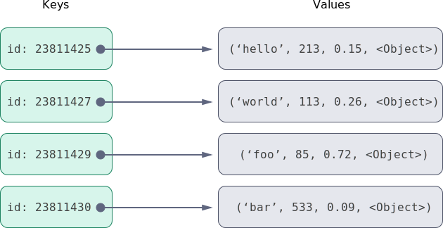

# key-value-database

A key-value store is a database that operates similar to a Python dictionary but stored in a file. There are the important get and set methods that the dictionary contains, but the key-value store will also provide an API for saving to disk, loading from disk, range queries of data. My goal is to create an easy to use, flexible, and adaptable key value store that other developers could use in their projects.

There are multiple implementations of the key-value store that are used in production grade systems worldwide. Some example open source implementations are Redis, CouchDB, Mongo, and Cassandra (which uses a b-tree as the underlying datastructure). These are just a few of the major projects that implement a key-value store that is similar to the one I've created.

